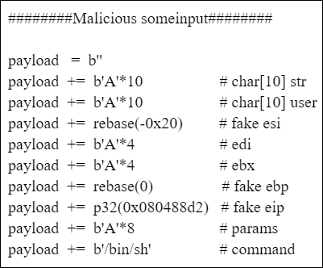
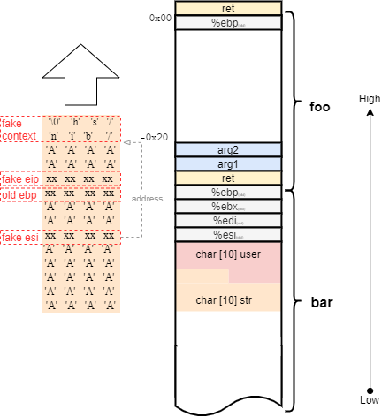
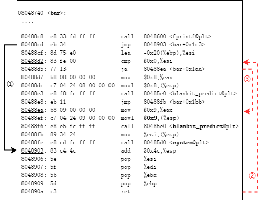

## BlankIt Attack
> To attack BlankIt by fake context
>


### Snapshot


### Environment
- `LLVM version 5.0.0`
- `clang version 5.0.0`
- `Ubuntu GLIBC 2.23-0ubuntu11 2.23`
- `pin-3.6-97554-31f0a167d`

### Victim

see:[example.c](./example.c)

### Manual
### 0. Download
download code to Home.
```shell
cd ~
git clone https://xxxxxx.git
```
### 1. Build BlankIt Backend

```shell
./build.sh -clean #clean up
./build.sh
```
if success, you can see the result in ./build

### 2. Run Blankit Runtime
```shell
./run_blankit.sh
cat blankit.log  # runtime log
```

### 3. Attack Blankit

1. **condition**: turn off `ASLR`

2. **check your main ebp**:

    a. run blankit: `./run_blankit.sh`

    b. check victim pid: `ps aux|grep example`

    c. gdb attach: `gdb attach $pid `

    d. in main stack: `info register ebp` 

3. **set main ebp** in `attack_fake_context.py`

    ```python
    #### main stack ebp #####
    MAIN_EBP=0xffffd0d8
    ```
4. **attck**: `python3 attack_fake_context.py`

### Details

#### Key Code



Specifically, we construct fake `%eip`, `%ebp`, `%esi` and `context`  by overflowing the local variables in the stack. The fake `%eip` points to the proper location of RDF and call site. The fake `context` contains the arguments, and then the registers such as `%esi` hold the address of the fake `context`.

In fact, it is not always necessary to forge these three factors for prediction to attack BlankIt. Specifically, for statically non-divergent functions  (roughly 27 %), there is no prediction. For some function arguments, there is no argument or just only one RDF ID.

#### Overflow Illustration



The function **foo** calls function **bar**, and there is a buffer overflow point in local variable `char[10] str`. We place the fake `context` that will be judged by BlankIt into **foo** stack, and then saved the address of fake `context` in `%esi`.

#### Control Flow



Arrow 1 indicates the normal return control flow.  Arrow 2 shows the control flow is hijacked to the prediction code in BlankIt by fake `%eip`.  Arrow 3 illustrates the embed decision tree is bypassed by fake `%esi` (which affected the decision making), and then we are able to invoke the function whatever we want to call (e.g., `system`). 